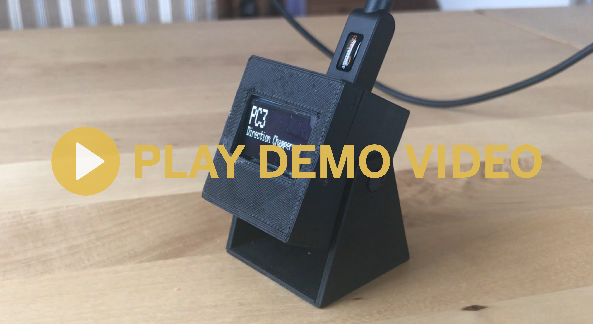

## ARDUINOBRIBUS 🚌

*Build your own shelter display using some Arduino boards & 3D printing parts*

    

### Step 1: Mission ID

Find the **id** related to the mission, in the file located under **json/bus_missions.json**\
Mission object looks like:

    {
      "id":"100100020",
      "name":"Gare de Lyon / Gare Saint-Lazare",
      "shortName":"B20",
      "image":"b20.gif"
    }

Change the **sMissionId** value in **arduino/arduino.ino** with the id of your mission.\
*Example: 100100099 in my case*

### Step 2: Station ID

Open the following URL with your own mission ID: http://restratpws.azurewebsites.net/api/stations/<YOUR_MISSION_ID> and get the **id** of your station.\
Station object looks like:

    {
        "id":"PC3_1039_1091",
        "name":"Camille Flammarion"
    }

Change the **sStationId** value in **arduino/arduino.ino** with the id of your station.\
*Example: PC3_1047_1074 in my case*

### Step 3: Way (A/R)

The last value is the way of the bus ("a" or "r").\
To know the way, open the following URL with your own http://restratpws.azurewebsites.net/api/directions/<YOUR_MISSION_ID>.\
Direction object looks like:

    [
        {
            "way":"A",
            "name":"Porte Maillot"
        },
        {
            "way":"R",
            "name":"Skanderbeg"
        }
    ]

Change the **sWay** value in **arduino/arduino.ino** with the way you want to display.\
*Example: "a" in my case*

### Schematics

Wemos PIN | OLED PIN
--- | ---
5V | VDD
GND | GND
D5 | SCK
D1 | DC
D3 | RES
D7 | SDA
D8 | CS

### Components 🗒

 - [Wemos D1 Mini - 2,21€](https://fr.aliexpress.com/item/ESP8266-ESP12-ESP-12-WeMos-D1-Mini-WIFI-Dev-Kit-Development-Board-NodeMCU-Lua/32653918483.html?spm=a2g0s.9042311.0.0.p9Sauh)
 - [OLED screen 128X64 2,05€](https://fr.aliexpress.com/item/Free-Shipping-2014-white-New-10Pcs-lot-128X64-OLED-LCD-LED-Display-Module-For-Arduino-0/32359892898.html?spm=a2g0s.9042311.0.0.hztmxX)

**✅ Total: 4,26€**

### Links ⚙️

 - [GitHub - REST API for RATP](https://github.com/ferreirix/restratp)
 - [Fiche PC3](https://www.ratp.fr/sites/default/files/fiches-horaires/busratp/pc3.pdf)
 - [Img to logo for OLED](http://www.instructables.com/id/How-to-use-OLED-display-arduino-module/)
 - [3D Abribus](https://www.thingiverse.com/thing:2379938)
 - [3D OLED 0.96](https://www.thingiverse.com/thing:2176764)
 - [3D Box Wemos + OLED](https://www.thingiverse.com/thing:2798623)
 - [3D Standard OLED box with place for board](https://www.thingiverse.com/thing:2662079)
